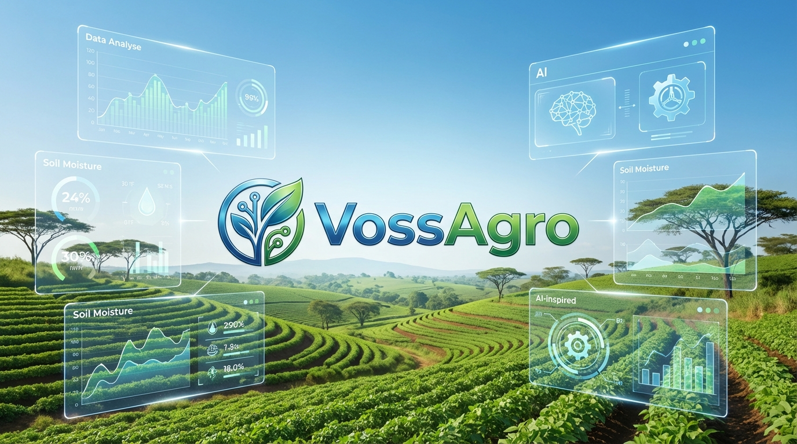
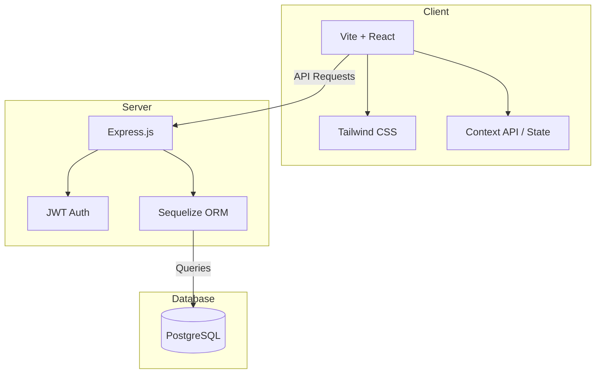

<p align="center">
  
</p>

<h1 align="center">VossAgro</h1>

<p align="center">
  <strong>Empowering Ghana's Agricultural Ecosystem through Technology and AI.</strong>
</p>

<p align="center">
  
  
  
  
  
  
</p>

---

## 🌍 About VossAgro

VossAgro is a comprehensive digital platform designed to revolutionize the agricultural landscape in Ghana. By bridging the gap between farmers, buyers, and investors, we create a transparent, efficient, and data-driven marketplace.

### Key Pillars
- **🌱 Marketplace**: A direct-to-consumer hub for fresh agricultural produce.
- **💰 Funding Hub**: Connecting promising farmers with grants and investment opportunities.
- **🗺️ Land Access**: A streamlined system for leasing and listing farmland.
- **🤖 AI Insights**: Leveraging data to provide regional price predictions and agricultural advice.

---

## 🏗️ Architecture

VossAgro is built on a modern full-stack architecture designed for scalability and performance.



---

## 🚀 Technical Evolution

This project reflects a journey of continuous improvement:
1.  **Inception**: Bootstrapped with Create React App (CRA) for rapid prototyping.
2.  **Modernization**: Migrated to **Vite** to achieve near-instant HMR and lightning-fast build speeds.
3.  **Security**: Implemented isolated authentication tables and multi-role JWT management.

---

## 🛠️ Quick Start

### Prerequisites
- **Node.js** (v18+)
- **PostgreSQL** (Running locally or on a server)

### Installation

1. **Clone the repository**
   ```bash
   git clone https://github.com/kormladorwu/VossAgroProject.git
   cd VossAgroProject
   ```

2. **Setup the Server**
   ```bash
   cd server
   npm install
   # Configure your .env file (see OWNERS_GUIDE.md for details)
   npx sequelize-cli db:migrate
   npm run dev
   ```

3. **Setup the Client**
   ```bash
   cd ../client
   npm install
   npm run dev
   ```

---

## 🛡️ User Roles & Access
VossAgro supports a robust multi-role system:
- **Farmers**: List produce, apply for funding, and manage land.
- **Buyers**: Browse marketplace, manage cart, and track orders.
- **Investors**: Provide grants and monitor agricultural impact.
- **Admins**: System-wide monitoring, user verification, and moderation.

---

## 📈 Future Roadmap
- [ ] Cloud Storage Integration (AWS S3/Cloudinary)
- [ ] Mobile Money (MoMo) Payment Gateway
- [ ] Real-time Weather & Soil Analytics
- [ ] Progressive Web App (PWA) Support

---

## 📄 Documentation
For detailed technical guides and business logic, please refer to:
- [Owner's Guide](OWNERS_GUIDE.md)
- [Future Roadmap](FUTURE_ROADMAP.md)
- [Client README](client/README.md)

---

<p align="center">
  Built with ❤️ for the future of Ghana's Agriculture.
</p>
